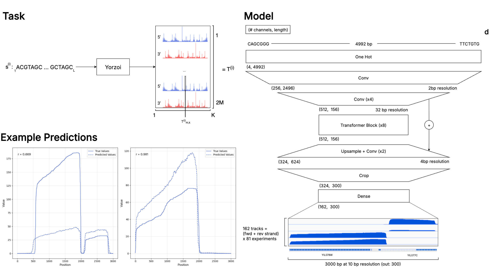

# Yorzoi: RNA-seq coverage prediction from DNA sequence
> [!NOTE]  
> In case of any questions, reach out to mail@timonschneider.de - always happy to help!

yorzoi is a deep neural network that predicts RNA-seq coverage from DNA sequence in Yeast (S. Cerevisiae). It is available via PyPI and Huggingface (see installation).


## No-Code Usage (no coding or installation required)
Yorzoi is available at [yorzoi.eu](https://www.yorzoi.eu). If you want more control over the model you need to install it as a PyPI package (see [Installation](##installation)).

## HTTP API (no installation or GPU required)
If you just want to get model predictions programmatically but don't need direct model access, you can use our API. (Cold start) Requests might take up to 10s. Here is an example request: 
```bash
curl --request POST \
  --url https://tom-ellis-lab--yorzoi-app-fastapi-app.modal.run/generate \
  --header 'Content-Type: application/json' \
  --data '{
  "sequences": ["ACGTGT"]
}'
```
or the same in Python: 
```bash
pip install requests
```
```python
import requests

url = "https://tom-ellis-lab--yorzoi-app-fastapi-app.modal.run/generate"
payload = {
    "sequences": ["ACGTGT"]
}
headers = {
    "Content-Type": "application/json"
}

response = requests.post(url, json=payload, headers=headers)

print("Status code:", response.status_code)
print("Response body:", response.json())

# The JSON object maps each input sequence to a ``(162, 3000)`` array of
# predicted coverage values. For example, a request with ``{"sequences": ["ACGTGT"]}``
# would yield ``{"ACGTGT": [[0, 1, 2, ...], [...], ...]}`` where the nested
# arrays correspond to the different RNA‑seq tracks. The first 81 tracks are
# the forward strand (+) and the remaining 81 tracks are the reverse strand (-).
# Track names for both strands are provided in ``track_annotation.json``.

import json
import matplotlib.pyplot as plt
import numpy as np

# Example: visualise the forward (+) and reverse (-) coverage of the first track
result = response.json()
predictions = np.array(result["ACGTGT"])  # key is the input sequence
with open("track_annotation.json") as f:
    annotation = json.load(f)

fwd_name = annotation["+"][0]
rev_name = annotation["-"][0]

plt.plot(predictions[0], label=f"{fwd_name} (+)")
plt.plot(predictions[81], label=f"{rev_name} (-)")
plt.xlabel("Position [bp]")
plt.ylabel("Predicted coverage")
plt.legend()
plt.show()
```

## Installation

1. You will need an NVIDIA GPU to run _Yorzoi_.
2. Create a new virtual environment (e.g.: `python -m venv .venv`) and activate it (e.g. `source .venv/bin/activate`)
3. `pip install yorzoi`
4. _Yorzoi_ requires [FlashAttention2](https://github.com/Dao-AILab/flash-attention) to run (check below if you haven't installed FA before).

This project was developed with Python version 3.9.19. In case you struggle with the installation - let me know (email below).

## Quick Start: Make a prediction

Find a more extensive demo in [demo.ipynb](demo.ipynb)

```python
import random
import torch
from yorzoi.dataset import GenomicDataset
from yorzoi.model.borzoi import Borzoi

model = Borzoi.from_pretrained("tom-ellis-lab/yorzoi")
model.to("cuda:0")
model.eval()

def random_dna_sequence(length):
    return ''.join(random.choices('ACGT', k=length))

sequences = torch.stack([torch.tensor(GenomicDataset.one_hot_encode((random_dna_sequence(4992))), dtype=torch.float32) for _ in range(5)])

print(f"\nPredicting RNA-seq coverage for {sequences.shape[0]} sequences\n")

sequences = sequences.to("cuda:0")

with torch.autocast(device_type="cuda"):
    predictions = model(sequences)
```

# Dataset

You can find the preprocessed training data here: https://huggingface.co/datasets/tom-ellis-lab/yeast-RNA-seq. The raw data (e.g. fasta and bam/bed/bigwig files) is currently being prepared for distribution.

# Roadmap

- [ ] Publish evaluation code and data
- [ ] Publish data processing tools and raw data

# Contact

In case of any issues, feedback or thoughts, here is my email: mail@timonschneider.de

# Appendix

## Installing FlashAttention2

With less than 10 CPUs and limited memory FlashAttention might take hours to build (i.e. via the canonical `pip install flash-attn`). This is why I recommend downloading a pre-built wheel. To select the right wheel from https://github.com/Dao-AILab/flash-attention/releases you have to first find out a few things about your environment. To do so, run:

```
   python - <<'PY'
   import sys, platform, re, json
   try:
       import torch
       info = {
           # Python ABI tag (e.g. cp310)
           "python_tag": f"cp{sys.version_info.major}{sys.version_info.minor}",
           # Exact Torch version string
           "torch_version": torch.__version__,
           # CUDA tag embedded in the Torch wheel (e.g. +cu124)
           "torch_cu_tag": (re.search(r'\+cu\d+', torch.__version__) or ["cpu"])[0],
           # CUDA runtime that Torch was built against
           "cuda_runtime": torch.version.cuda or "cpu",
           # Was Torch built with the new C++11 ABI?
           "cxx11abi": torch.compiled_with_cxx11_abi()  #  ≙ torch._C._GLIBCXX_USE_CXX11_ABI
                       if hasattr(torch, "compiled_with_cxx11_abi")
                       else getattr(torch._C, "_GLIBCXX_USE_CXX11_ABI", "n/a"),
           # GPU model and compute capability
           "gpu_name": torch.cuda.get_device_name(0) if torch.cuda.is_available() else "none",
           "compute_capability": ("sm{}{}".format(*torch.cuda.get_device_capability(0))
                               if torch.cuda.is_available() else "none"),
           # OS/architecture tag (linux_x86_64, win_amd64, …)
           "os_tag": f"{platform.system().lower()}_{platform.machine()}"
       }
       print(json.dumps(info, indent=2))
   except ImportError:
       print("PyTorch is not installed in this environment.")
   PY
```

This will print something like:

```
{
     "python_tag": "cp39",
     "torch_version": "2.7.1+cu126",
     "torch_cu_tag": "+cu126",
     "cuda_runtime": "12.6",
     "cxx11abi": true,
     "gpu_name": "NVIDIA RTX A6000",
     "compute_capability": "sm86",
     "os_tag": "linux_x86_64"
}
```

You can then either manually search for the wheel or have ChatGPT find it for you. Example prompt:

```
I'm looking to install FlashAttention2 as a prebuilt wheel for my environment. I ran:

python - <<'PY'
import sys, platform, re, json
try:
    import torch
    info = {
        # Python ABI tag (e.g. cp310)
        "python_tag": f"cp{sys.version_info.major}{sys.version_info.minor}",
        # Exact Torch version string
        "torch_version": torch.__version__,
        # CUDA tag embedded in the Torch wheel (e.g. +cu124)
        "torch_cu_tag": (re.search(r'\+cu\d+', torch.__version__) or ["cpu"])[0],
        # CUDA runtime that Torch was built against
        "cuda_runtime": torch.version.cuda or "cpu",
        # Was Torch built with the new C++11 ABI?
        "cxx11abi": torch.compiled_with_cxx11_abi()  #  ≙ torch._C._GLIBCXX_USE_CXX11_ABI
                    if hasattr(torch, "compiled_with_cxx11_abi")
                    else getattr(torch._C, "_GLIBCXX_USE_CXX11_ABI", "n/a"),
        # GPU model and compute capability
        "gpu_name": torch.cuda.get_device_name(0) if torch.cuda.is_available() else "none",
        "compute_capability": ("sm{}{}".format(*torch.cuda.get_device_capability(0))
                            if torch.cuda.is_available() else "none"),
        # OS/architecture tag (linux_x86_64, win_amd64, …)
        "os_tag": f"{platform.system().lower()}_{platform.machine()}"
    }
    print(json.dumps(info, indent=2))
except ImportError:
    print("PyTorch is not installed in this environment.")
PY

which resulted in:

{
    "python_tag": "cp39",
    "torch_version": "2.7.1+cu126",
    "torch_cu_tag": "+cu126",
    "cuda_runtime": "12.6",
    "cxx11abi": true,
    "gpu_name": "NVIDIA RTX A6000",
    "compute_capability": "sm86",
    "os_tag": "linux_x86_64"
}

Please select the correct wheel from https://github.com/Dao-AILab/flash-attention/releases for me base on the provided information. In case no suitable wheel is available, suggest ways to minimally change my environment to match an available wheel.
```
