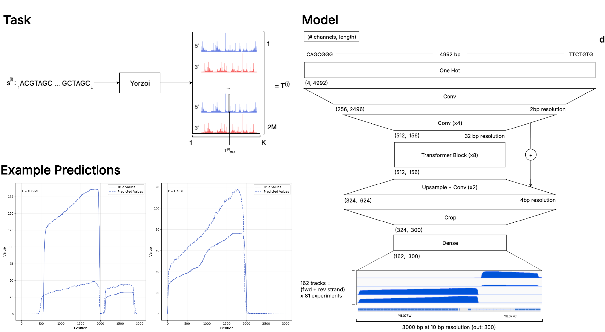

# Yorzoi: RNA-seq coverage prediction from DNA sequence
> [!NOTE]  
> In case of any questions, reach out to mail@timonschneider.de - always happy to help!

yorzoi is a deep neural network that predicts RNA-seq coverage from DNA sequence in Yeast (S. Cerevisiae). It is available via PyPI and Huggingface (see installation).


## No-Code Usage (no coding or installation required)
Yorzoi is available at [yorzoi.eu](https://www.yorzoi.eu). If you want more control over the model you need to install it as a PyPI package (see [Installation](#installation)).

## HTTP API (no installation or GPU required)
If you just want to get model predictions programmatically but don't need direct model access, you can use our API. (Cold start) Requests might take up to 10s. Here is an example request: 
```bash
curl --request POST \
  --url https://tom-ellis-lab--yorzoi-app-fastapi-app.modal.run/generate \
  --header 'Content-Type: application/json' \
  --data '{
  "sequences": ["ACGTGT"]
}'
```
or the same in Python: 
```bash
pip install requests
```
```python
import requests

url = "https://tom-ellis-lab--yorzoi-app-fastapi-app.modal.run/generate"
payload = {
    "sequences": ["ACGTGT"]
}
headers = {
    "Content-Type": "application/json"
}

response = requests.post(url, json=payload, headers=headers)

print("Status code:", response.status_code)
print("Response body:", response.json())

# The JSON object maps each input sequence to a ``(162, 3000)`` array of
# predicted coverage values. For example, a request with ``{"sequences": ["ACGTGT"]}``
# would yield ``{"ACGTGT": [[0, 1, 2, ...], [...], ...]}`` where the nested
# arrays correspond to the different RNA‑seq tracks. The first 81 tracks are
# the forward strand (+) and the remaining 81 tracks are the reverse strand (-).
# Track names for both strands are provided in ``track_annotation.json``.

import json
import matplotlib.pyplot as plt
import numpy as np

# Example: visualise the forward (+) and reverse (-) coverage of the first track
result = response.json()
predictions = np.array(result["ACGTGT"])  # key is the input sequence
with open("track_annotation.json") as f:
    annotation = json.load(f)

fwd_name = annotation["+"][0]
rev_name = annotation["-"][0]

plt.plot(predictions[0], label=f"{fwd_name} (+)")
plt.plot(predictions[81], label=f"{rev_name} (-)")
plt.xlabel("Position [bp]")
plt.ylabel("Predicted coverage")
plt.legend()
plt.show()
```

## Installation

1. An NVIDIA GPU is recommended for fast inference. CPU works but is much slower.
2. _Yorzoi_ requires Python 3.12+ and PyTorch 2.5+ (for grouped-query attention support in `scaled_dot_product_attention`).
3. To work with a local checkout of this repository, run:
```bash
uv python install 3.12
uv sync
source .venv/bin/activate
```
4. To install the published package from PyPI instead, run:
```bash
uv venv --python 3.12
source .venv/bin/activate
uv pip install yorzoi
```

Yorzoi uses PyTorch's built-in flash-attention (via `scaled_dot_product_attention`), so no separate `flash-attn` install is needed.

In case you struggle with the installation - let me know (email below).

## Quick Start: Make a prediction

Find a more extensive demo in [demo.ipynb](demo.ipynb)

```python
import random
import torch
from yorzoi.dataset import GenomicDataset
from yorzoi.model.borzoi import Borzoi

model = Borzoi.from_pretrained("tom-ellis-lab/yorzoi")
model.to("cuda:0")
model.eval()

def random_dna_sequence(length):
    return ''.join(random.choices('ACGT', k=length))

sequences = torch.stack([torch.tensor(GenomicDataset.one_hot_encode((random_dna_sequence(4992))), dtype=torch.float32) for _ in range(5)])

print(f"\nPredicting RNA-seq coverage for {sequences.shape[0]} sequences\n")

sequences = sequences.to("cuda:0")

with torch.autocast(device_type="cuda"):
    predictions = model(sequences)
```

# Dataset

You can find the preprocessed training data here: https://huggingface.co/datasets/tom-ellis-lab/yeast-RNA-seq. The raw data (e.g. fasta and bam/bed/bigwig files) is currently being prepared for distribution.

# Roadmap

- [ ] Publish evaluation code and data
- [ ] Publish data processing tools and raw data

# Contact

In case of any issues, feedback or thoughts, here is my email: mail@timonschneider.de
